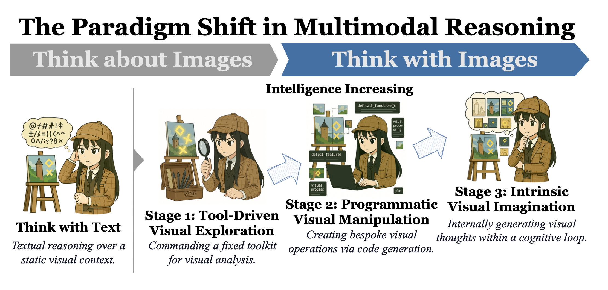
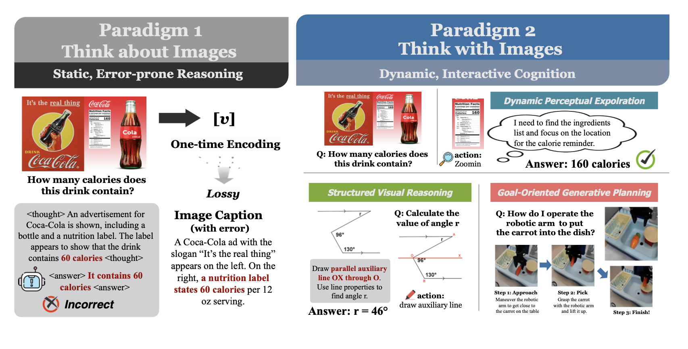
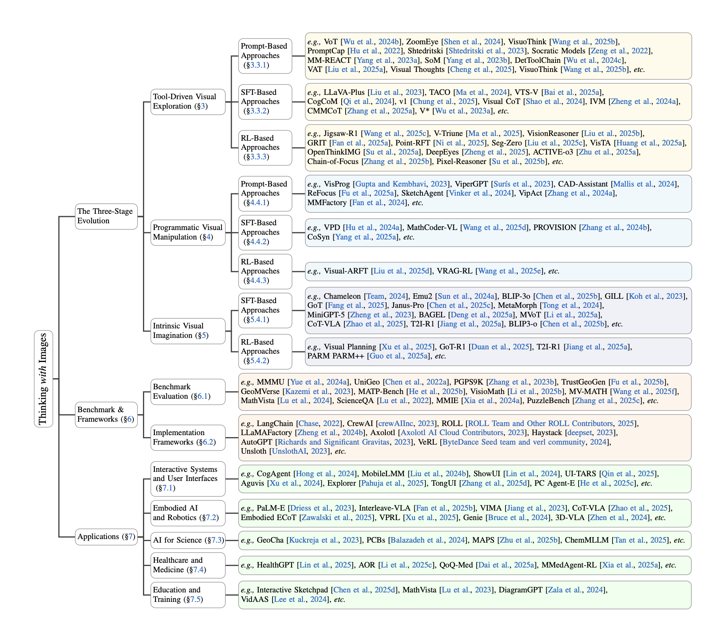

# 🧠🤖 Awesome-Think-With-Images

<div align="center">
  
  <h1 align="center">Thinking with Images: Next Frontier in Multimodal AI</h1>
  <p align="center">
    This repository accompanies our survey paper: <br>
    <a href="https://arxiv.org/pdf/2506.23918"><strong>Thinking with Images for Multimodal Reasoning: Foundations, Methods, and Future Frontiers</strong></a>
  </p>
  
  [](https://github.com/zhaochen0110/Awesome_Think_With_Images) 
  [](https://opensource.org/licenses/MIT)
   

</div>


## Introduction

Welcome to Awesome-Think-With-Images! The field of multimodal AI is undergoing a fundamental evolution, moving beyond static visual perception towards a new paradigm where vision becomes a **dynamic, manipulable cognitive workspace**. This repository is the first comprehensive resource that systematically curates the pivotal research enabling this shift.

We structure this collection along a trajectory of increasing cognitive autonomy, as detailed in our survey. This journey unfolds across three key stages:

1.  **Stage 1: Tool-Driven Visual Exploration** — Models as "Commanders" orchestrating external visual tools.
2.  **Stage 2: Programmatic Visual Manipulation** — Models as "Visual Programmers" creating bespoke analyses.
3.  **Stage 3: Intrinsic Visual Imagination** — Models as "Visual Thinkers" generating internal mental imagery.

<div align="center">
  
  <p><em>The paradigm shift from “Thinking about Images” to “Thinking with Images”, an evolution that transforms vision from a static input into a dynamic and manipulable cognitive workspace.</em></p>
</div>

As detailed in our survey, this paradigm shift unlocks three key capabilities: **Dynamic Perceptual Exploration**, **Structured Visual Reasoning**, and **Goal-Oriented Generative Planning**. This collection is for researchers, developers, and enthusiasts eager to explore the forefront of AI that can truly see, reason, and imagine.

<div align="center">
  
  <p><em>Conceptual comparison of “Thinking about Images” versus “Thinking with Images”.</em></p>
</div>

We structure this collection along a trajectory of increasing cognitive autonomy. This journey unfolds across three key stages, forming the taxonomy of our work:

<div align="center">
  
  <p><em>The taxonomy of "Thinking with Images" organizing the field into core methodologies (across three stages), evaluation benchmarks, and key applications.</em></p>
</div>

This collection is for researchers, developers, and enthusiasts eager to explore the forefront of AI that can truly see, reason, and imagine.

---


## 🔔 News
-   **[2025-07]** We have released ["Thinking with Images for Multimodal Reasoning: Foundations, Methods, and Future Frontiers"](https://arxiv.org/pdf/2506.23918), the **first comprehensive survey** dedicated to the emerging paradigm of "Think with Images". 
-   **[2025-06]** We created this repository to maintain a paper list on Awesome-Think-With-Images. Contributions are welcome!
-   **[2025-05]** We are excited to release **[OpenThinkIMG](https://github.com/OpenThinkIMG/OpenThinkIMG)**, the first dedicated end-to-end open-source framework designed to empower LVLMs to truly **think with images**! For ease of use, we've configured a Docker environment. We warmly invite the community to explore, use, and contribute.

---

## 📜 Table of Contents

-   [**Stage 1: Tool-Driven Visual Exploration**](#-stage-1-tool-driven-visual-exploration)
    -   [Prompt-Based Approaches](#-prompt-based-approaches)
    -   [SFT-Based Approaches](#-sft-based-approaches)
    -   [RL-Based Approaches](#-rl-based-approaches)
-   [**Stage 2: Programmatic Visual Manipulation**](#-stage-2-programmatic-visual-manipulation)
    -   [Prompt-Based Approaches](#-prompt-based-approaches-1)
    -   [SFT-Based Approaches](#-sft-based-approaches-1)
    -   [RL-Based Approaches](#-rl-based-approaches-1)
-   [**Stage 3: Intrinsic Visual Imagination**](#-stage-3-intrinsic-visual-imagination)
    -   [SFT-Based Approaches](#-sft-based-approaches-2)
    -   [RL-Based Approaches](#-rl-based-approaches-2)
-   [**Evaluation & Benchmarks**](#-evaluation--benchmarks)
    -   [Benchmarks for Thinking with Images](#-benchmarks-for-thinking-with-images)
-   [**Contributing & Citation**](#-contributing--citation)

---

## 🧭 The Three-Stage Evolution of Thinking with Images

*This section provides a conceptual map to navigate the paper list. The following papers are organized according to the primary mechanism they employ, aligning with the three-stage framework from our survey.*

---

## 🛠️ Stage 1: Tool-Driven Visual Exploration

*In this stage, the model acts as a planner, orchestrating a predefined suite of external visual tools. Intelligence is demonstrated by selecting the right tool for the right sub-task.*

### ➤ Prompt-Based Approaches
*Leveraging in-context learning to guide tool use without parameter updates.*
- [Socratic Models: Composing Zero-Shot Multimodal Reasoning with Language](https://arxiv.org/abs/2204.00598) 
- [PromptCap: Prompt-Guided Task-Aware Image Captioning](https://arxiv.org/abs/2211.09699) 
- [MM-REACT: Prompting ChatGPT for Multimodal Reasoning and Action](https://arxiv.org/abs/2303.11381) 
- [What does CLIP know about a red circle? Visual prompt engineering for VLMs](https://arxiv.org/abs/2304.06712) 
- [Set-of-Mark Prompting Unleashes Extraordinary Visual Grounding in GPT-4V](https://arxiv.org/abs/2310.11441) 
- [DetToolChain: A New Prompting Paradigm to Unleash Detection Ability of MLLM](https://arxiv.org/abs/2403.12488) 
- [Chain-of-Spot: Interactive Reasoning Improves Large Vision-Language Models](https://arxiv.org/abs/2403.12966) 
- [Mind's Eye of LLMs: Visualization-of-Thought Elicits Spatial Reasoning in Large Language Models](https://arxiv.org/abs/2404.03622) 
- [ZoomEye: Enhancing Multimodal LLMs with Human-Like Zooming Capabilities through Tree-Based Image Exploration](https://arxiv.org/abs/2411.16044) 
- [DyFo: A Training-Free Dynamic Focus Visual Search for Enhancing LMMs in Fine-Grained Visual Understanding](https://arxiv.org/abs/2504.14920) 
- [VisuoThink: Empowering LVLM Reasoning with Multimodal Tree Search](https://arxiv.org/abs/2504.09130) 
- [Visual Thoughts: A Unified Perspective of Understanding Multimodal Chain-of-Thought](https://arxiv.org/abs/2505.15510) 
- [Visual Abstract Thinking Empowers Multimodal Reasoning](https://arxiv.org/abs/2505.20164) 
- [MLLMs Know Where to Look: Training-free Perception of Small Visual Details with Multimodal LLMs](https://arxiv.org/abs/2502.17422) 

### ➤ SFT-Based Approaches
*Fine-tuning models on data demonstrating how to invoke tools and integrate their outputs.*
- [LLaVA-Plus: Learning to Use Tools for Creating Multimodal Agents](https://arxiv.org/abs/2311.05437) 
- [V*: Guided Visual Search as a Core Mechanism in Multimodal LLMs](https://arxiv.org/abs/2312.14135) 
- [CogCoM: Train Large Vision-Language Models Diving into Details through Chain of Manipulations](https://arxiv.org/abs/2402.04236) 
- [Visual CoT: Unleashing Chain-of-Thought Reasoning in Multi-Modal Language Models](https://arxiv.org/abs/2403.16999) 
- [Instruction-Guided Visual Masking](https://arxiv.org/abs/2405.19783) 
- [From the Least to the Most: Building a Plug-and-Play Visual Reasoner via Data Synthesis](https://arxiv.org/abs/2406.19934) 
- [TACO: Learning Multi-modal Action Models with Synthetic Chains-of-Thought-and-Action](https://arxiv.org/abs/2412.05479) 
- [CMMCoT: Enhancing Complex Multi-Image Comprehension via Multi-Modal Chain-of-Thought and Memory Augmentation](https://arxiv.org/abs/2503.05255) 
- [UniVG-R1: Reasoning Guided Universal Visual Grounding with Reinforcement Learning](https://arxiv.org/abs/2505.14231) 
- [Don’t Look Only Once: Towards Multimodal Interactive Reasoning with Selective Visual Revisitation](https://arxiv.org/pdf/2505.18842) 
- [VGR: Visual Grounded Reasoning](https://arxiv.org/abs/2506.11991) 
- [Multi-Step Visual Reasoning with Visual Tokens Scaling and Verification](https://arxiv.org/abs/2506.07235) 


### ➤ RL-Based Approaches
*Using rewards to train agents to discover optimal tool-use strategies.*
- [Seg-Zero: Reasoning-Chain Guided Segmentation via Cognitive Reinforcement](https://arxiv.org/abs/2503.06520) 
- [GRIT: Teaching MLLMs to Think with Images](https://arxiv.org/abs/2505.15879) 
- [Point-RFT: Improving Multimodal Reasoning with Visually Grounded Reinforcement Finetuning](httpshttps://arxiv.org/abs/2505.19702) 
- [OpenThinkIMG: Learning to Think with Images via Visual Tool Reinforcement Learning](https://arxiv.org/abs/2505.08617) 
- [VisionReasoner: Unified Visual Perception and Reasoning via Reinforcement Learning](https://arxiv.org/abs/2505.12081) 
- [DeepEyes: Incentivizing "Thinking with Images" via Reinforcement Learning](https://arxiv.org/abs/2505.14362) 
- [Chain-of-Focus: Adaptive Visual Search and Zooming for Multimodal Reasoning via RL](https://arxiv.org/abs/2505.15436) 
- [Pixel Reasoner: Incentivizing Pixel-Space Reasoning with Curiosity-Driven Reinforcement Learning](https://arxiv.org/abs/2505.15966) 
- [One RL to See Them All: Visual Triple Unified Reinforcement Learning](https://arxiv.org/abs/2505.18129) 
- [UniVG-R1: Reasoning Guided Universal Visual Grounding with Reinforcement Learning](https://arxiv.org/pdf/2505.14231) 
- [VisualToolAgent (VisTA): A Reinforcement Learning Framework for Visual Tool Selection](https://arxiv.org/pdf/2505.20289) 
- [Active-O3: Empowering Multimodal Large Language Models with Active Perception via GRPO](https://arxiv.org/pdf/2505.21457) 
- [Reinforcing Spatial Reasoning in Vision-Language Models with Interwoven Thinking and Visual Drawing](https://arxiv.org/abs/2506.09965) 
---

## 💻 Stage 2: Programmatic Visual Manipulation

*Here, models evolve into "visual programmers," generating executable code (e.g., Python) to create custom visual analyses. This unlocks compositional flexibility and interpretability.*

### ➤ Prompt-Based Approaches
*Guiding models to generate code as a transparent, intermediate reasoning step.*
- [Visual programming: Compositional visual reasoning without training](https://arxiv.org/abs/2211.11559) 
- [ViperGPT: Visual Inference via Python Execution for Reasoning](https://arxiv.org/abs/2303.08128) 
- [Visual sketchpad: Sketching as a visual chain of thought for multimodal language models](https://arxiv.org/abs/2406.09403) 
- [VipAct: Visual-perception enhancement via specialized vlm agent collaboration and tool-use](https://arxiv.org/abs/2410.16400) 
- [SketchAgent: Language-Driven Sequential Sketch Generation](https://arxiv.org/abs/2411.17673) 
- [CAD-Assistant: Tool-Augmented VLLMs as Generic CAD Task Solvers?](https://arxiv.org/abs/2412.13810) 
- [MMFactory: A Universal Solution Search Engine for Vision-Language Tasks](https://arxiv.org/abs/2412.18072) 
- [ReFocus: Visual Editing as a Chain of Thought for Structured Image Understanding](https://arxiv.org/abs/2501.05452) 
- [Interactive Sketchpad: A Multimodal Tutoring System for Collaborative, Visual Problem-Solving](https://arxiv.org/abs/2503.16434) 

### ➤ SFT-Based Approaches
*Distilling programmatic logic into models or using code to bootstrap high-quality training data.*
- [Visual Program Distillation: Distilling Tools and Programmatic Reasoning into Vision-Language Models](https://arxiv.org/abs/2312.03052) 
- [ProVision: Programmatically Scaling Vision-centric Instruction Data for Multimodal Language Models](https://arxiv.org/abs/2412.07012) 
- [Scaling Text-Rich Image Understanding via Code-Guided Synthetic Multimodal Data Generation](https://arxiv.org/abs/2502.14846) 
- [Advancing vision-language models in front-end development via data synthesis](https://arxiv.org/abs/2503.01619) 
- [MathCoder-VL: Bridging Vision and Code for Enhanced Multimodal Mathematical Reasoning](https://arxiv.org/abs/2505.10557) 

### ➤ RL-Based Approaches
*Optimizing code generation policies using feedback from execution results.*
- [Visual Agentic Reinforcement Fine-Tuning](https://arxiv.org/abs/2505.14246) 
- [ProgRM: Build Better GUI Agents with Progress Rewards](https://arxiv.org/abs/2505.18121) 

---

## 🎨 Stage 3: Intrinsic Visual Imagination

*The most advanced stage, where models achieve full cognitive autonomy. They generate new images or visual representations internally as integral steps in a closed-loop thought process.*

### ➤ SFT-Based Approaches
*Training on interleaved text-image data to teach models the grammar of multimodal thought.*
- [Generating images with multimodal language models](https://arxiv.org/abs/2305.17216) 
- [NExT-GPT: Any-to-Any Multimodal LLM](https://arxiv.org/abs/2309.05519) 
- [Minigpt-5: Interleaved vision-and-language generation via generative vokens](https://arxiv.org/abs/2310.02239) 
- [Generative multimodal models are in-context learners](https://arxiv.org/abs/2312.13286) 
- [SEED-X: Multimodal Models with Unified Multi-granularity Comprehension and Generation](https://arxiv.org/abs/2404.14396) 
- [Chameleon: Mixed-Modal Early-Fusion Foundation Models](https://arxiv.org/abs/2405.09818) 
- [Show-o: One single transformer to unify multimodal understanding and generation](https://arxiv.org/abs/2408.12528) 
- [Transfusion: Predict the Next Token and Diffuse Images with One Multi-Modal Model](https://arxiv.org/abs/2408.11039) 
- [Emu3: Next-Token Prediction is All You Need](https://arxiv.org/abs/2409.18869) 
- [VILA-U: a Unified Foundation Model Integrating Visual Understanding and Generation](https://arxiv.org/abs/2409.04429) 
- [Janus: Decoupling Visual Encoding for Unified Multimodal Understanding and Generation](https://arxiv.org/abs/2410.13848) 
- [Metamorph: Multimodal understanding and generation via instruction tuning](https://arxiv.org/abs/2412.14164) 
- [LMFusion: Adapting Pretrained Language Models for Multimodal Generation](https://arxiv.org/abs/2412.15188) 
- [TokenFlow: Unified Image Tokenizer for Multimodal Understanding and Generation](https://arxiv.org/abs/2412.03069) 
- [Dual Diffusion for Unified Image Generation and Understanding](https://arxiv.org/abs/2501.00289) 
- [Janus-Pro: Unified Multimodal Understanding and Generation with Data and Model Scaling](https://arxiv.org/abs/2501.17811) 
- [Imagine while Reasoning in Space: Multimodal Visualization-of-Thought](https://arxiv.org/abs/2501.07542) 
- [GoT: Unleashing Reasoning Capability of Multimodal Large Language Model for Visual Generation and Editing](https://arxiv.org/abs/2503.10639) 
- [Cot-vla: Visual chain-of-thought reasoning for vision-language-action models](https://arxiv.org/abs/2503.22020) 
- [Transfer between Modalities with MetaQueries](https://arxiv.org/abs/2504.06256) 
- [BLIP3-o: A Family of Fully Open Unified Multimodal Models-Architecture, Training and Dataset](https://arxiv.org/abs/2505.09568) 
- [Emerging properties in unified multimodal pretraining](https://arxiv.org/abs/2505.14683) 
- [Mogao: An Omni Foundation Model for Interleaved Multi-Modal Generation](https://arxiv.org/abs/2505.05472) 
- [Thinking with Generated Images](https://arxiv.org/abs/2505.22525) 
- [UniFork: Exploring Modality Alignment for Unified Multimodal Understanding and Generation](https://arxiv.org/abs/2506.17202) 
- [Show-o2: Improved Native Unified Multimodal Models](https://arxiv.org/abs/2506.15564) 


### ➤ RL-Based Approaches
*Empowering models to discover generative reasoning strategies through trial, error, and reward.*
- [Can We Generate Images with CoT? Let's Verify and Reinforce Image Generation Step by Step](https://arxiv.org/abs/2501.13926) 
- [Visual Planning: Let's Think Only with Images](https://arxiv.org/abs/2505.11409) 
- [T2I-R1: Reinforcing Image Generation with Collaborative Semantic-level and Token-level CoT](https://arxiv.org/abs/2505.00703) 
- [GoT-R1: Unleashing Reasoning Capability of MLLM for Visual Generation with Reinforcement Learning](https://arxiv.org/abs/2505.17022) 
- [Delving into RL for Image Generation with CoT: A Study on DPO vs. GRPO](https://arxiv.org/abs/2505.17017) 
- [Robotic Control via Embodied Chain-of-Thought Reasoning](https://arxiv.org/abs/2407.08693) 
- [FutureSightDrive: Thinking Visually with Spatio-Temporal CoT for Autonomous Driving](https://arxiv.org/abs/2505.17685)
- [ControlThinker: Unveiling Latent Semantics for Controllable Image Generation through Visual Reasoning](https://arxiv.org/abs/2506.03596)

---

## 📊 Evaluation & Benchmarks

*Essential resources for measuring progress. These benchmarks are specifically designed to test the multi-step, constructive, and simulative reasoning capabilities required for "Thinking with Images".*

### ➤ Benchmarks for Thinking with Images
- [A Cognitive Evaluation Benchmark of Image Reasoning and Description for Large Vision-Language Models](https://arxiv.org/abs/2402.18409) 
- [m&m's: A Benchmark to Evaluate Tool-Use for multi-step multi-modal Tasks](https://arxiv.org/abs/2403.11085) 
- [Vgbench: Evaluating large language models on vector graphics understanding and generation](https://arxiv.org/abs/2407.10972) 
- [ARC Prize 2024: Technical Report](https://arxiv.org/abs/2412.04604) 
- [CrossWordBench: Evaluating the Reasoning Capabilities of LLMs and LVLMs with Controllable Puzzle Generation](https://arxiv.org/abs/2504.00043) 
- [WorldScore: A Unified Evaluation Benchmark for World Generation](https://arxiv.org/abs/2504.00983) 
- [MME-Unify: A Comprehensive Benchmark for Unified Multimodal Understanding and Generation Models](https://arxiv.org/abs/2504.03641) 
- [PointArena: Probing Multimodal Grounding Through Language-Guided Pointing](https://arxiv.org/abs/2505.09990) 
- [ChartMuseum: Testing Visual Reasoning Capabilities of Large Vision-Language Models](https://arxiv.org/abs/2505.13444) 
- [Can MLLMs Guide Me Home? A Benchmark Study on Fine-Grained Visual Reasoning from Transit Maps](https://arxiv.org/abs/2505.18675) 
- [PhyX: Does Your Model Have the "Wits" for Physical Reasoning?](https://arxiv.org/abs/2505.15929) 
- [OCR-Reasoning Benchmark: Unveiling the True Capabilities of MLLMs in Complex Text-Rich Image Reasoning](https://arxiv.org/abs/2505.17163)    
- [VisualQuality-R1: Reasoning-Induced Image Quality Assessment via Reinforcement Learning to Rank](https://arxiv.org/abs/2505.14460)  

---

## 🙏 Contributing & Citation

We welcome contributions! If you have a paper that fits into this framework, please open a pull request. Let's build this resource together.

If you find our survey and this repository useful for your research, please consider citing our work:

```bibtex
@misc{su2025thinkingimagesmultimodalreasoning,
      title={Thinking with Images for Multimodal Reasoning: Foundations, Methods, and Future Frontiers}, 
      author={Zhaochen Su and Peng Xia and Hangyu Guo and Zhenhua Liu and Yan Ma and Xiaoye Qu and Jiaqi Liu and Yanshu Li and Kaide Zeng and Zhengyuan Yang and Linjie Li and Yu Cheng and Heng Ji and Junxian He and Yi R. and Fung},
      year={2025},
      eprint={2506.23918},
      archivePrefix={arXiv},
      primaryClass={cs.CV},
      url={https://arxiv.org/abs/2506.23918}, 
}
```

## Star History

[](https://www.star-history.com/#zhaochen0110/Awesome_Think_With_Images&Date)
